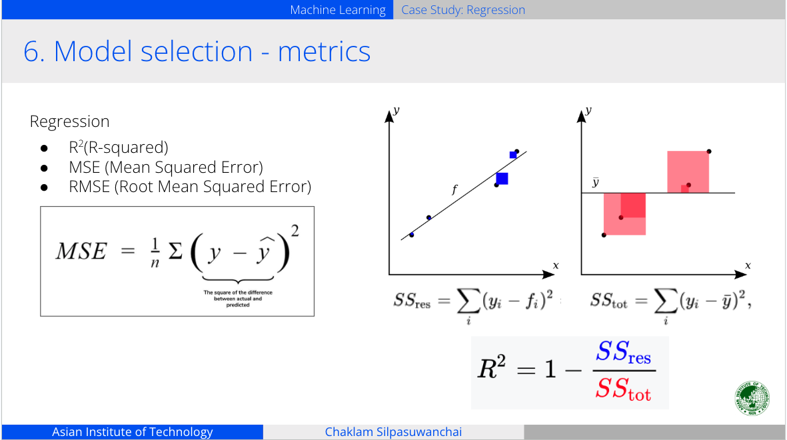

# A1 - Predicting Car Price

## What you need?
- Data set [Car.csv](data/Cars.csv)
- Problem Definition [A1 Predicting Car Price](assignments/A1__Predicting_Car_Price.pdf)


## Project Plan
Excerpt from [L1 Case Study: Regression Slide](https://docs.google.com/presentation/d/1WXpXKuDN4UrUvRlnzpDaotqAHMwD7RJDZlW6PhoPK94/edit?slide=id.g22991d6db18_1_883#slide=id.g22991d6db18_1_883) <br>
1. Load data<br>
(Prepare your data)<br>
    a. Load data from CSV file and inspect file format and content in high level <br>
        - Data format: CSV, JSON, Database(SQL)<br>
    b. Cleanup and encoding <br>
2. Exploratory Data Analysis<br>
(understand your data) <br>
    a. Check class imbalance<br>
    b. Label encoding: Map each category to a single integer ( A->0, B -> 1, C -> 2)<br>ex. male => 0; female => 1<br>
    c. Univariate <br>
    - Countplot ( when x is discrete<br>
    - Distribution plot(when x is continuous)<br>
    d. Multivariate<br>
    - Boxplot (when x is discrete, and y is continuous)<br>
    - Scatter plot (when x and y are continuous)<br>
    - Correlation Matrix (when x and y are continuous)<br>
    - Predictive Power Score<br>
    e. One-hot encoding: Create a new binary column per category; mark 1 for the present category, 0 otherwise.<br>E.g., Male, Female, Unknown ⇒  [1, 0, 0] if male;   [0, 1, 0] if female <br>
    Tips:  one thing you need to know is that you can always cut down one column
[1, 0, 0], [0, 1, 0], [0, 0, 1] is same as [1, 0], [0, 1], [0, 0] by setting ‘drop_first=True’<br>
3. Feature engineering<br>
    a. Dimensionality reduction - reduce dimensions, e.g, Principal Component Analysis (maximizes variances), Discriminant Analysis (maximizes separability)<br>
    b. Feature splitting - Jan 26, 2023 ===>  Monday  or  January <br>
    c. Creating features (e.g., some equation) - combining the total sales from each sale department<br>


> Note: After such engineering, you can always go back to exploratory analysis
<br>
4. Feature selection<br>
    a. select x features<br>
    > Rule of thumb:  Good features MUST NOT BE correlated, i.e., independent
    <br><br> 
    > Rule of thumb:  Correlation is not causation; don’t pick features using correlation only;  it should make sense!
<br>E.g., Number of trees is correlated with number of divorce <br><br>
    > Rule of thumb:  For ML, less features are usually better (but NOT necessarily for DL)
<br>

    b. select y target <br>
    c. Split train/test <br>
    > Rule of thumb:  Always split BEFORE preprocessing, to prevent data leakage
<br> Can be done in this order:  (1) splitting, (2) imputation, (3) scaling


5. Preprocessing<br>
    a. Imputing missing values<br>
    b. Outliers<br>
    c. Fix class imbalance<br>
    d. Typos/Entry errors/Duplicates/IDs<br>
    e. Scale your features <br>
        i. Standardization<br>
        ``` 
        (x - mean) / std <br>
        when your data follows normal distribution 
        ``` <br>
        ii. Normalization
        ```
        (x - x_min) / (x_max - x_min) when your data DOES NOT follow normal distribution (e.g., audio, signal, image)```
        <br>
    > Rule of thumb:  Scale after you split and fill all the missing values<br>
    > Rule of thumb:  Scale your test set using training distribution, NOT testing distribution<br>
    > Rule of thumb:  DON’T scale your categorical features<br>

6. Model selection<br>
    a. Regresssion<br>
    > It’s not ok to use test-set to compare
We use cross-validation!

7. Testing<br>
    a. Regression (r2, MSE)<br>
    
8. Analysis<br>
    a. Analyse model - feature importance<br>
9. Inference<br>
    a. Apply your best model on some unseen data and see whether it makes sense<br>
10. Deployment<br>
 a. Docker / Plotly<br>


